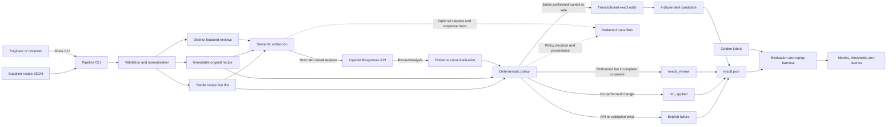
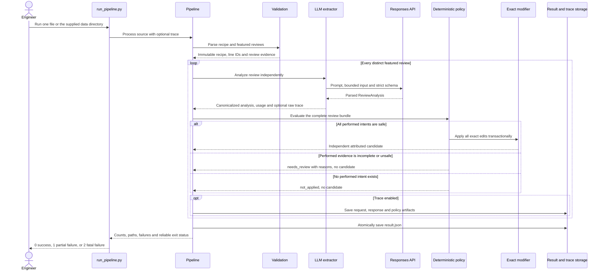

# Assessment report

## Executive verdict

The inherited pipeline could produce plausible JSON but could not establish that
it worked. It randomly chose one review, compressed that review into one
modification category, used fuzzy search and partial string replacement, and
considered the run successful when any recipe produced output. This was a demo,
not an evidence-processing system.

The replacement is evaluation-first and fail-visible. It interprets every
featured review once, preserves all atomic intents and their evidence states,
then hands control to deterministic policy. Each review can produce one
transactional alternative from the original recipe; reviews are not combined.

## Assumptions and scope

- `featured_tweaks` is the authoritative evidence set for this assignment. Other
  reviews are not silently promoted into the pipeline.
- One review represents one observed experiment. Its performed changes may have
  been tasted together, so they are applied atomically rather than cherry-picked.
- Different reviews are independent alternatives from an immutable original;
  they are not cumulative instructions and are never merged implicitly.
- Only grounded, complete, performed changes are eligible for execution.
  Recommendations, future plans, preferences and hypotheses remain visible but
  do not become recipe mutations.
- The supplied recipe lines are the current source of truth. An edit may execute
  only when its stable line ID exists and its complete expected text still
  matches exactly.
- The data has no trustworthy helpful-vote or controlled-comparison signal, so
  the system does not invent a primary candidate or rank alternatives.
- Model output is untrusted interpretation, not authorization. Deterministic
  software owns grounding, conflict detection, preconditions and mutation.
- A recipe with no featured tweaks is a valid zero-call result. A malformed file
  or failed model call is an explicit failure, not an empty success.
- The six supplied recipes and 12 featured reviews support an assignment-specific
  evaluation, not a claim of broad recipe-domain or food-safety generalization.
- Live execution requires an OpenAI API key and access to the configured model;
  deterministic tests, policy checks and benchmark replay do not require an API
  call.

## Why the initial implementation was not extended

An abandoned candidate implementation's 37 tests passed. It nevertheless had the
wrong shape for a four-hour assessment: roughly 6,500 added lines, separate
initial/revision/verifier model passes, regex-driven semantic gates, a large
taxonomy, and an older default model. Its self-reported perfect evaluation did
not compensate for the complexity or the small number of useful outputs.

The final implementation therefore restarted from the supplied source baseline
and retained only the architecture justified by the data and evaluation.

## Before and after

| Concern | Inherited behavior | Replacement behavior |
|---|---|---|
| Evidence | Random modification review | All 12 `featured_tweaks`, exact deduplication |
| Meaning | Assumes a tweak exists | Extracts all intents, outcomes, sentiment, and evidence state |
| LLM contract | JSON mode plus manual parsing | Responses API with strict Pydantic structured output |
| Model | `gpt-3.5-turbo` default | `gpt-5.6-terra`, medium reasoning, configurable |
| Semantic calls | Retry-oriented and later overbuilt into three passes | Exactly one interpretation call per review |
| Targeting | Fuzzy `SequenceMatcher` and substring replacement | Stable line IDs and exact full-line preconditions |
| Complex intent | One edit-shaped object | One semantic intent may own multiple coordinated exact edits |
| Review handling | One review per run | One co-tested bundle per review |
| Cross-review handling | Undefined/sequential | Independent alternatives; no merge |
| Failure | Warning while continuing; possible false success | `needs_review`, `not_applied`, or explicit extraction failure |
| Verification | Test passes if output count is greater than zero | 55 tests, 90% coverage gate, 34 intent labels, 20 outcome labels, and 14 field-level edits |

## Final engineering audit: inherited and candidate fixes

The final audit separated weaknesses inherited from the starter from gaps created
or retained by the replacement. Origin does not reduce ownership: every behavior
in the submission is treated as ours to fix or explicitly defer.

| Finding | Origin | Final remediation |
|---|---|---|
| One randomly selected review determines the recipe | Casper starter | Analyze every distinct featured review once and emit independent alternatives from the immutable original |
| Fuzzy matching plus partial string replacement can mutate the wrong text or record a no-op | Casper starter | Stable line IDs, exact full-line preconditions, explicit operations and transactional application |
| JSON mode/manual parsing gives a weak model contract | Casper starter | Responses API strict Pydantic structured output with no model tools or direct mutation |
| Sequential edits obscure which combination was actually tested | Casper starter | Preserve performed changes from one review as one atomic co-tested bundle; never merge reviews implicitly |
| Missing fields silently become `unknown`/empty | Inherited and initially retained | Required IDs, titles, non-empty typed recipe lines, bounded reviews and explicit validation errors |
| Source IDs influence output paths | Inherited risk, retained in a different form | Sanitized stable path components, Windows-reserved-name handling, containment checks and symlink rejection |
| Partial work can appear successful | Inherited pattern, incompletely fixed initially | Per-file/per-review failure records plus CLI exit `1` for any extraction failure and `2` for fatal input errors |
| Vulnerable `python-dotenv` lock | Inherited dependency | Upgraded to `1.2.3`; locked runtime dependency audit reports no known vulnerabilities |
| Prompt injection and unbounded cost | Inherent/inherited LLM risk | Input is explicitly untrusted data; review/file/payload/call bounds plus bounded retries, timeout and output tokens |
| Empty quote passes substring grounding | Replacement bug | Structured strings require non-empty content; grounding still requires a contiguous exact source span |
| Duplicate edit IDs across intents | Replacement bug | Review-global intent/edit uniqueness and dependency integrity checks |
| Outcome claims were not policy-grounded | Replacement gap | Exact outcome quote grounding and known/unique intent-reference validation block unsafe bundles |
| Trace leaked absolute workstation paths | Replacement observability gap | Relative paths, bounded/redacted errors and explicit sensitive-content disclosure |
| Package/pipeline version drift | Replacement consistency gap | One `1.0.0` release version, asserted in tests and evaluation metadata |
| Intent-only evaluation overstated correctness | Replacement evaluation gap | Strict anchor matching, outcome recall, bundle/candidate labels, 14 field-level edits, replay and artifact hashes |
| Empty featured text and maximal inserted provenance IDs were under-tested | Replacement boundary gaps | Reject empty featured evidence and hash inserted provenance into a bounded deterministic identifier |
| Golden labels had syntax checks but no corpus-integrity guard | Replacement test gap | Assert exact coverage of all 12 supplied reviews, valid enums/targets/preconditions, grounded anchors and edit/status consistency |

The hardening is covered by adversarial regression tests, a 90% coverage gate,
Ruff, Bandit, compilation, lock validation, a clean dependency audit and a
read-only GitHub Actions workflow on Python 3.11 and 3.13.

## Transferable architecture patterns

The implementation applies general architecture knowledge rather than reusing
domain-specific code: open-ended semantic understanding instead of regex intent
routing, strict typed outputs, evidence grounding, abstention on missing
information, immutable source artifacts, deterministic post-model enforcement,
provenance, and evaluation-first iteration. No former-employer code, prompts,
data, or proprietary implementation was reused.

The image-understanding analogy is direct: a model interprets arbitrary visual
evidence and extraction intent, while deterministic software constrains downstream
behavior. Here the model interprets review language, tense, causality, sentiment,
implicit changes, and experiment boundaries; deterministic code then constrains
recipe execution.

Detailed transferables and all early worked examples—including same-target sugar
conflicts, different-stage sugar/egg/air-fryer reviews, evidence states, no-ops,
multi-line intents, and alternatives—are preserved in
`docs/architecture_patterns_and_examples.md`.

## System design

The system intentionally separates semantic interpretation from execution
authority. The LLM can describe meaning and propose typed edits, but only the
deterministic policy layer can authorize a transactional candidate.



### One-review execution sequence



## Design decisions

### Open semantic extraction, closed execution

The model is used where rules are weakest: distinguishing “I used,” “I will use,”
“I prefer,” causal claims, implicit substitutions, and several changes sharing one
verb. It must copy exact evidence spans and may abstain from executable edits.

The model is not used for conflict resolution or mutation. This avoids regex as a
substitute for language understanding while preventing model prose from directly
changing stored recipe text.

### Evidence state and actionability are separate

“I will use more broth next time” is a future intent, not a performed result.
“I added a tiny dash of cinnamon” is performed but incomplete. The first is
`not_applied`; the second makes the performed bundle `needs_review`. This
two-dimensional policy prevents sentiment or tense from being mistaken for safe
execution.

### Review bundle atomicity

A review's performed tweaks were tasted together. Applying only its sugar change
while omitting its water, chilling, and cream-of-tartar changes would attribute the
reported result to an untested recipe. Therefore all safe performed intents in one
review commit transactionally. Non-performed intents stay visible but do not block
the performed bundle.

### Intent is not the same as edit

The first schema allowed one line edit per intent. Replaying live output
showed that this produced zero candidates: “omit nuts” must remove the ingredient
and update the mixing instruction. The schema was corrected so one semantic
intent owns multiple coordinated `RecipeEdit` records. This increased safe output
to three alternatives without weakening preconditions.

### Conflict policy

Two replacements of the same original line are a conflict. A removal colliding
with another edit is also a conflict. A replacement plus insertion after the same
anchor is compatible: insertions apply first in stable order, followed by the
replacement. The original precondition must still match for every operation.

### No arbitrary primary candidate

The supplied data contains featured order and ratings but no helpful-vote count or
controlled comparison between variants. The system labels candidates as
alternatives and does not claim a winner. Ranking can be added when a legitimate
signal and product objective exist.

### Observable API and policy boundary

Running `src/run_pipeline.py` with `--trace` saves a redacted artifact set for
every review:

```text
trace/run-summary.json
trace/review-0-request.json
trace/review-0-response.json
trace/review-0-policy.json
...
```

The request file contains the exact application-level `responses.parse` model,
instructions, serialized input, generated `ReviewAnalysis` JSON Schema, reasoning
effort, token ceiling, tool configuration and `store=false`. The response contains
the public response ID/status/model, usage, latency, output text and parsed object.
The policy file contains the deterministic decision, reasons, candidate and
before/after provenance.

Credentials, authorization headers and `.env` contents are never part of the
trace. The trace explicitly states that OpenAI internal reasoning is not returned
by the API and is therefore not represented. Paths are relative and the artifact
warns that review/recipe content may be sensitive. A deterministic resolver may
repair only a unique case-only quote mismatch by copying the exact span from the
review; ambiguous or paraphrased evidence still fails.

## Evaluation

`evaluation/golden_labels.json` covers every featured review across four recipes:
34 intent/evidence/kind/actionability labels, 20 primary outcome anchors, expected
bundle status for every review, and 14 field-level edits for the three executable
cookie alternatives. Two recipes with no featured tweaks exercise the zero-call
path. The evaluator also records model/prompt/schema/label hashes and can replay a
stored report without making an API call.

The final `gpt-5.6-terra` run and deterministic rescore produced:

| Metric | Result |
|---|---:|
| Intent recall | 88.2% (30/34) |
| Labeled intent precision | 81.1% |
| Evidence-state accuracy on matched | 100% |
| Intent-kind accuracy on matched | 93.3% |
| Actionability accuracy on matched | 90.0% |
| Primary outcome recall | 100% (20/20) |
| Intent/outcome quote grounding | 100% / 100% |
| Bundle status / candidate presence | 100% / 100% |
| Edit target-operation recall / precision | 100% / 100% (14/14) |
| Edit precondition / required output | 100% / 100% |
| Exact applied bundles | 100% (3/3) |
| Failed calls | 0/12 |
| Tokens | 27,404 input / 12,652 output |
| Sequential latency | 157.2 seconds |
| Bundle decisions | 3 applied / 7 needs review / 2 not applied |

Three field-aware runs were retained locally during hardening. The first exposed
permissive/incorrect golden assumptions and real omission/grounding failures. The
second achieved all field edits but failed one exact outcome quote. The third
passed every frozen threshold. Its deterministic rescore accepted only explicitly
enumerated equivalent fractions (`0.5`/`1/2`, `1.5`/`1 1/2`) and valid insertion
anchors; extraction output was unchanged. The sanitized committed summary is
`evaluation/benchmark_summary.json`; full reports remain ignored because they
contain complete review/model content.

## Known limitations and next experiments

- The evaluation corpus is the assignment dataset, so it measures fit here rather
  than broad recipe-domain generalization.
- Field-level labels cover all three executable bundles but not every incomplete
  edit fragment in the seven needs-review reviews.
- Three strict runs exposed meaningful model variance, but this is still too few
  for production confidence; add a larger holdout and at least five frozen runs.
- Medium reasoning took about 157 seconds sequentially. Compare Terra against
  Luna on the same frozen labels before choosing a cheaper model or parallelism.
- No food-safety, allergen, nutrition, or serving-scale validation is claimed.
- Cross-review merging and ranking require product rules and stronger evidence;
  they are deliberately outside this implementation.

## Assessment deliverable map

- Comprehensive technical narrative: this report
  - Assumptions: `Assumptions and scope`
  - Problem analysis and solution approach: `Executive verdict`, `Why the initial
    implementation was not extended`, and `Before and after`
  - Technical decisions and rationale: `System design` and `Design decisions`
  - Implementation details and challenges: `Final engineering audit`,
    `Observable API and policy boundary`, and `Evaluation`
  - Future improvements: `Known limitations and next experiments` and
    `Production next step`
- Transferable architecture and worked examples:
  `docs/architecture_patterns_and_examples.md`
- Agent-use trajectory: `agent_trajectory.md`
- Executable setup and run instructions: `README.md`
- 5–7 minute video: external submission item, not a repository artifact

## Production next step

The next investment remains evaluation depth, not another agent layer: build a
separate holdout corpus, label incomplete-review edit fragments, run five frozen
repetitions, compare Terra and Luna on accuracy/cost/latency, and only then decide
whether selective escalation is justified.
